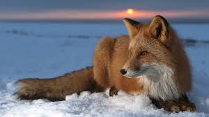

#About This Site
`Di dalam materinminggunpertama`,**_HACKTIV8_**  mengajarkan saya tentang membuat website sederhana dengan syntax **_HTML_**, tidak hanya syntax **_HTML_**, di sana juga di ajarkan bagaimana agar tampilan website yang di buat dengan **_HTML_** bisa terlihat lebih indah dan menarik tentunya, yaitu dnegan menggunakan **_CSS_**. Dengan kolaborasi **_HTML_** dan **_CSS_** nantinya tampilan website bisa terlihat lebih menarik. Nah setelah materi yang diberikan selesai dan beberapa tantangan juga sudah di lewati, di akhir pekan, hacktiv8 memberikan tantangan kepada muridnya supaya berkreasi membuat website sederhana ciptaan masing-masing muridnya. Dari situlah website tersebut akhirnya saya buat berdasarkan apa yang sudah saya dapatkan dari materi yang di berikan oleh **_HACKTIV8_**. Tags apa saja sih yang di gunakan dalam pembuatan website tersebut? Tentunya anda penasaran bukan ? okay..langsung saja kita liat ke bawah!!!!
## Use Tags & Syntaxes
Tags dan syyntaxes yang saya gunakan dalam membuat website tersebut adalah :
**HTML**

* html
* head
* body
* link
* div
* h1
* h2
* img
* p
* ol
* ul
* i
* table
* th
* tr
* td
* form
* input
* select
* option
* textarea

**CSS**

* background
* background-size
* box-sizing
* border
* border-radius
* color
* margin
* padding
* text-align
* text-transform
* letter-spacing
* width
* display
* font-weight
* font-size
* font-family
* font-style
* float
Semua tags di atas adalah beberapa tags yang saya gunakan untuk membuat webiste tersebut. Tapi karena terlalu banyak mungkin masih ada beberapa tags yang saya cantumkan di atas.

##Future plans
Dari tampilan Web yang di lihat sekarang mungkin sangat-sangat sederhana bahkan bisa di bilang acak-acakan dan belum berfungsi sama sekali, rencana saya ke depan setelah saya selesai mengikuti bootcamp ini saya akan mengembangkan web tersebut agar mempunyai tampilan yang lebih baik, memberikan manfaat yang banyak dan mempunyai nilai yang tinggi tentunya. Seperti apa sih nantinya tampilan dan isi dari webiste tersebut? agar tidak penasaran silahkan terus ikuti terus berita terupdate dari kamii, supaya tidak ketinggalan. Pastinya bakal seru dan bisa banyak belajar dari web tersebut. Terimakasih 

